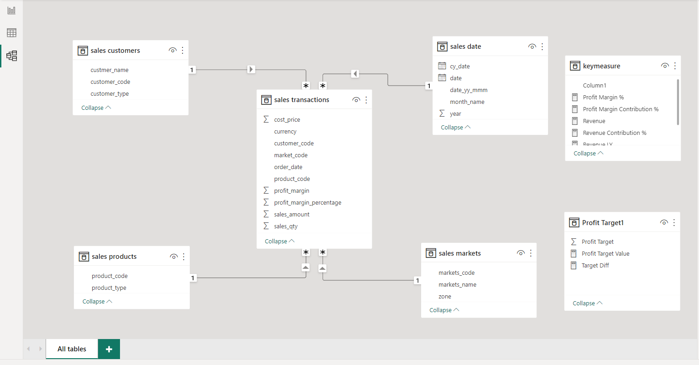
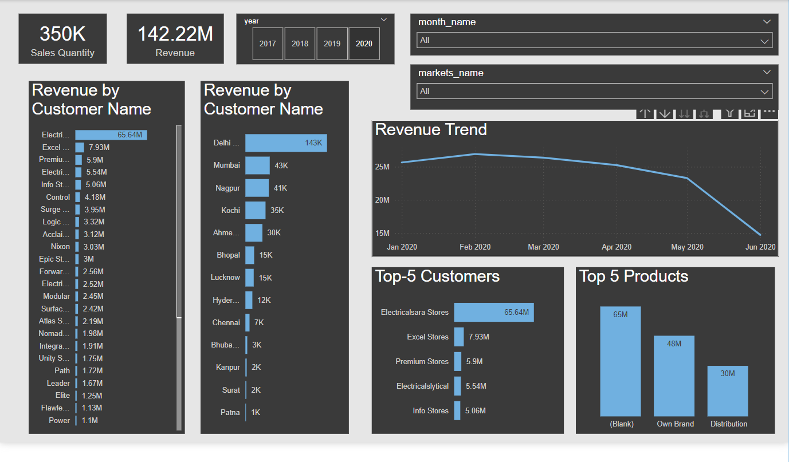

# **Project: Business Performance Insights – AtliQ Hardware**  

## **Problem Statement:**  

In this project, I worked on building a **business performance dashboard** for AtliQ Hardware.  

AtliQ Hardware is a company that supplies computer hardware and peripherals to clients like Surge Stores, Nomad Stores, etc., across India. Their head office is in Delhi, and they have multiple regional offices throughout the country.  

The **Sales Director** was struggling to track business growth in a **rapidly changing market**. Sales were declining, and he had no structured way to analyze business performance. Whenever he needed updates, he had to **call regional managers** (North, South, and Central India) to get insights over the phone. However, this verbal exchange lacked **proof and factual insights**. He could sense that business was going down, but he wasn’t getting the **full picture** from the managers.  

AtliQ Hardware is a **large-scale business**, and relying on manual updates wasn’t practical. The **Sales Director wanted a simple data visualization tool** to check key business insights daily. By leveraging such tools and technologies, companies can make **data-driven decisions** to improve performance.  

So, in this project, I built an **interactive dashboard using Power BI** to help AtliQ Hardware analyze and improve its business performance.  

---

## **Data Discovery:**  

### **Project Planning using AIMS Grid**  

AIMS Grid is a project management tool with four key components:  

- **Purpose** – What exactly needs to be done  
- **Stakeholders** – Who is involved  
- **End Result** – What we aim to achieve  
- **Success Criteria** – Optimizing cost and saving time  

### **AIMS Grid for this project:**  

1. **Purpose:** Unlock hidden business insights to support **data-driven decisions** and reduce **manual data gathering**.  
2. **Stakeholders:**  
   - Sales Director  
   - Marketing Team  
   - Customer Service Team  
   - Data & Analytics Team  
   - IT Team  
3. **End Result:** An **automated dashboard** that provides **real-time business insights** for better decision-making.  
4. **Success Criteria:**  
   - Dashboard gives **clear business insights** with the latest data.  
   - Sales team makes **better decisions**, leading to **10% cost savings**.  
   - Reducing **manual data gathering by 20%**, allowing time for **value-added activities**.  

---

## **Data Analysis using MySQL:**  

### **Steps:**  

1. **Imported data into MySQL Workbench** from an existing SQL database dump.  
2. **Explored and cleaned data** by identifying incorrect values.  
   - Found **garbage values** in the **market table**.  
   - Found **negative transaction values** and **USD transactions** in the **sales table**, which needed conversion to INR.  
3. **Performed SQL queries for business analysis:**  
   - Checked **customer records** and **total customers**.  
   - Filtered transactions based on **market code (e.g., Chennai, Mumbai, etc.)**.  
   - Found **distinct product codes sold** in different markets.  
   - Identified **USD transactions** and converted them into INR.  
   - Analyzed **year-wise, month-wise, and city-wise revenue** using **JOIN queries**.  

---

## **Data Cleaning and ETL (Extract, Transform, Load):**  

### **Steps:**  

1. **Connected MySQL database with Power BI**.  
2. **Loaded data into Power BI** and created a **star schema model**.  
3. **Transformed data using Power Query:**  
   - Removed **null values** from the market table.  
   - Filtered **negative and zero values** from the transactions table.  
   - Converted **USD transactions into INR** using a calculated column:  
     ```sql
     = Table.AddColumn(#"Filtered Rows", "norm_sales_amount", each if [currency] = "USD" then [sales_amount] * 75 else [sales_amount])
     ```
   - **Removed duplicate currency values** in MySQL Workbench.  
   - Ensured the data was **clean and structured** for analysis.  

---

## **Data Modeling:**  

Once the data was **cleaned and transformed**, it was ready for **data modeling** in Power BI.  

Here’s the final **sales insights data model:**  

  

---

## **Data Analysis using DAX (Power BI Calculations):**  

### **Key Measures:**  

- **Profit Margin %** = `DIVIDE([Total Profit Margin], [Revenue], 0)`  
- **Profit Margin Contribution %** = `DIVIDE([Total Profit Margin], CALCULATE([Total Profit Margin], ALL('sales products'), ALL('sales customers'), ALL('sales markets')))`  
- **Revenue** = `SUM('sales transactions'[sales_amount])`  
- **Revenue Contribution %** = `DIVIDE([Revenue], CALCULATE([Revenue], ALL('sales products'), ALL('sales customers'), ALL('sales markets')))`  
- **Revenue Last Year (LY)** = `CALCULATE([Revenue], SAMEPERIODLASTYEAR('sales date'[date]))`  
- **Sales Quantity** = `SUM('sales transactions'[sales_qty])`  
- **Total Profit Margin** = `SUM('Sales transactions'[Profit_Margin])`  

### **Profit Target Measures:**  

- **Profit Target Range** = `GENERATESERIES(-0.05, 0.15, 0.01)`  
- **Profit Target Value** = `SELECTEDVALUE('Profit Target1'[Profit Target])`  
- **Target Difference** = `[Profit Margin %] - 'Profit Target1'[Profit Target Value]`  

---

## **Dashboard & Data Visualization:**  

Built an **interactive Power BI dashboard** to visualize business performance insights.  

### **Key Insights:**  

| Dashboard |  
| -------- |  
|  |  
 
---

## **Tools, Software & Libraries Used:**  

1. **MySQL** – For data storage and analysis  
2. **Microsoft Power BI** – For dashboard and visualizations  
3. **Power Query Editor** – For data transformation  
4. **DAX (Data Analysis Expressions)** – For advanced calculations  

---
